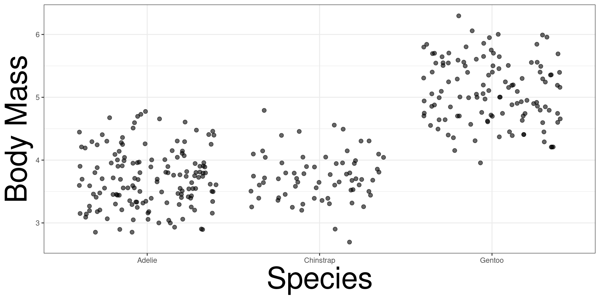
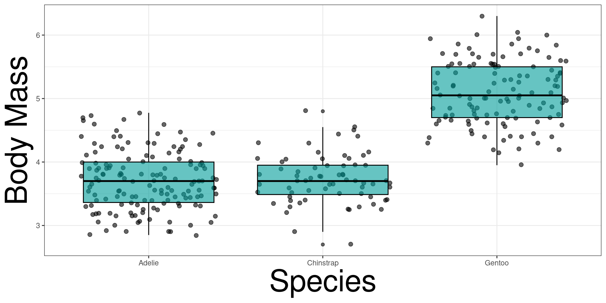
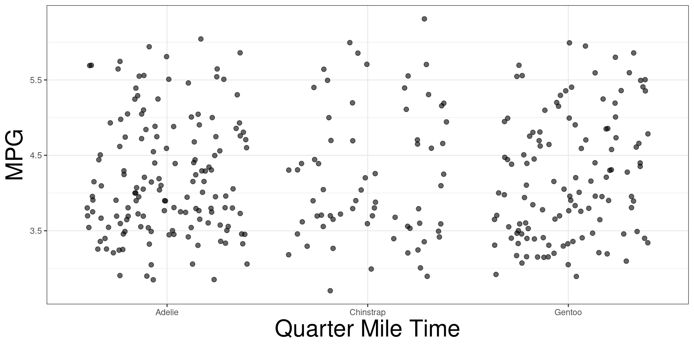
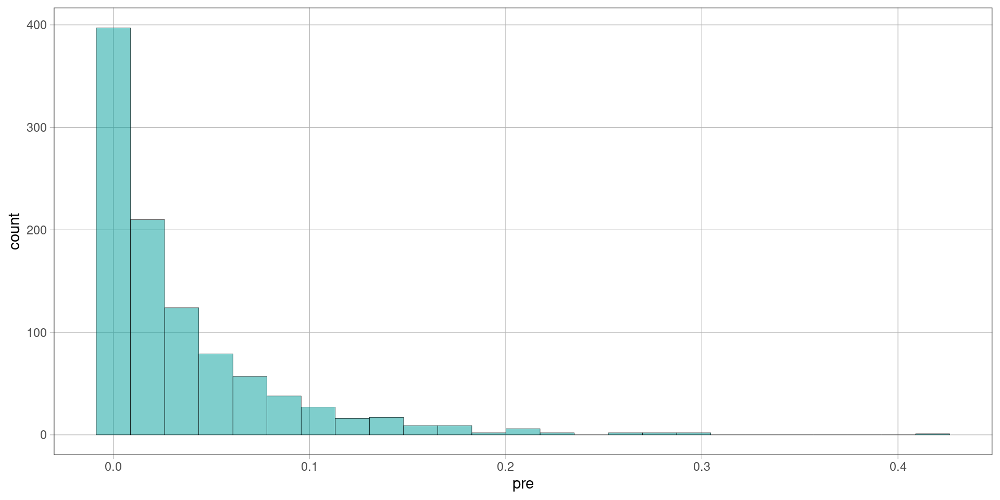
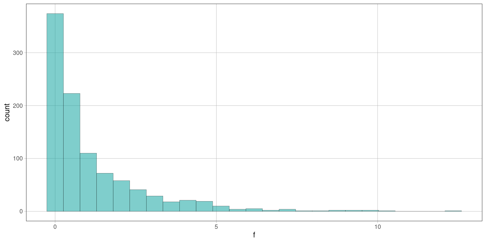
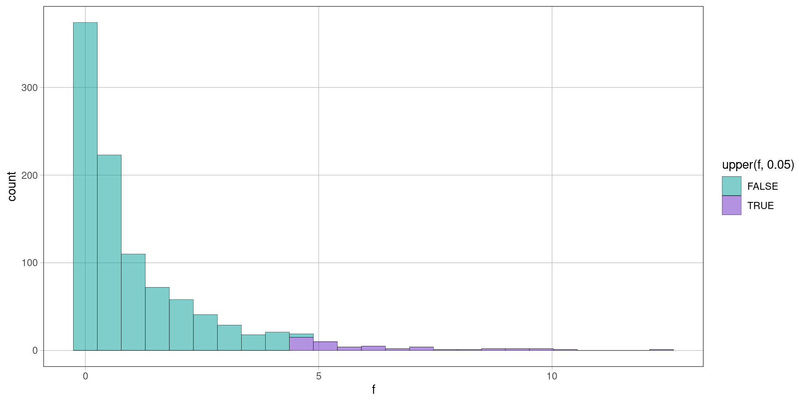
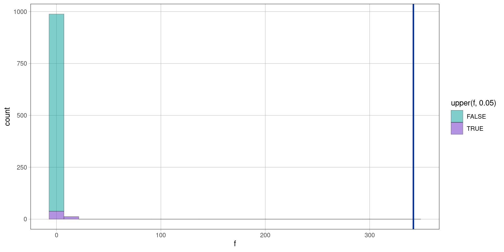
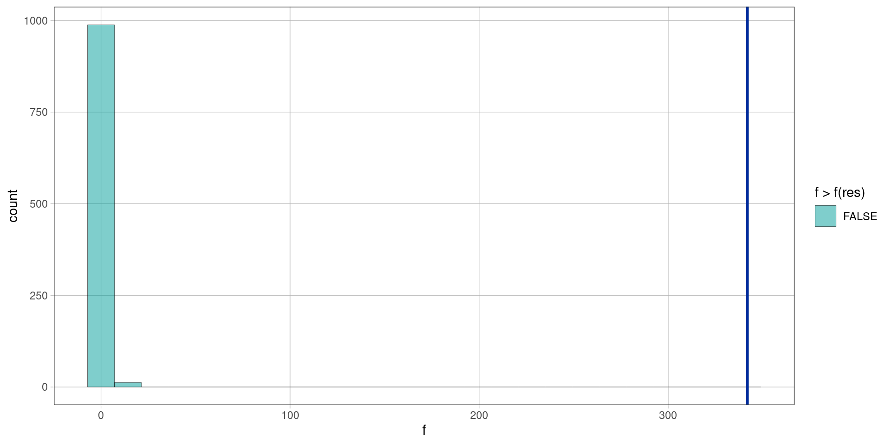

```{webr-r}
#| context: setup
webr::shim_install()
library(coursekata)
```

# Inference

## Motivating Example


::: {.cell}
::: {.cell-output-display}
{width=960}
:::
:::


## Adding a Box Plot


::: {.cell}
::: {.cell-output-display}
{width=960}
:::
:::


## Linear Model


::: {.cell}

```{.r .cell-code}
res <- penguins %>% lm(body_mass_kg ~ species, data = .)
res
```

::: {.cell-output .cell-output-stdout}

```
#> 
#> Call:
#> lm(formula = body_mass_kg ~ species, data = .)
#> 
#> Coefficients:
#>      (Intercept)  speciesChinstrap     speciesGentoo  
#>          3.70616           0.02692           1.38627
```


:::
:::


## Are the Means from each species different? Or is it due to random chance?

## Inference

The process to determine if an estimate of a parameter is valuable or just due to random chance.

## Randomness of Data


::: {.cell}

```{.r .cell-code}
penguins %>% gf_jitter(shuffle(body_mass_kg) ~ species) %>%
  gf_theme(theme_bw()) %>%
  gf_labs(x = "Quarter Mile Time", y = "MPG") %>%
  gf_theme(axis.title = element_text(size = 24))
```

::: {.cell-output-display}
{width=960}
:::
:::


## Empirical vs Shuffled

```{webr-r}
shuffle <- function(x){n <- length(x); return(sample(x, n))}
penguins |> ggplot(aes(x = species, y = body_mass_g)) +
  theme_bw() +labs(x = "Species", y = "Body Mass") + theme(axis.text = element_text(size = 18)) +
  geom_jitter()
```

## Obtaining F


::: {.cell}

```{.r .cell-code}
f(shuffle(mpg) ~ qsec, data = mtcars)
```

::: {.cell-output .cell-output-stdout}

```
#> [1] 1.247653
```


:::

```{.r .cell-code}
f(shuffle(mpg) ~ qsec, data = mtcars)
```

::: {.cell-output .cell-output-stdout}

```
#> [1] 2.973099
```


:::

```{.r .cell-code}
f(shuffle(mpg) ~ qsec, data = mtcars)
```

::: {.cell-output .cell-output-stdout}

```
#> [1] 0.6777638
```


:::

```{.r .cell-code}
f(shuffle(mpg) ~ qsec, data = mtcars)
```

::: {.cell-output .cell-output-stdout}

```
#> [1] 0.5489494
```


:::

```{.r .cell-code}
f(shuffle(mpg) ~ qsec, data = mtcars)
```

::: {.cell-output .cell-output-stdout}

```
#> [1] 0.5276875
```


:::

```{.r .cell-code}
f(shuffle(mpg) ~ qsec, data = mtcars)
```

::: {.cell-output .cell-output-stdout}

```
#> [1] 2.758505
```


:::
:::


## Obtaining PRE


::: {.cell}

```{.r .cell-code}
pre(shuffle(mpg) ~ qsec, data = mtcars)
```

::: {.cell-output .cell-output-stdout}

```
#> [1] 0.001641251
```


:::

```{.r .cell-code}
pre(shuffle(mpg) ~ qsec, data = mtcars)
```

::: {.cell-output .cell-output-stdout}

```
#> [1] 0.03680501
```


:::

```{.r .cell-code}
pre(shuffle(mpg) ~ qsec, data = mtcars)
```

::: {.cell-output .cell-output-stdout}

```
#> [1] 0.002159657
```


:::

```{.r .cell-code}
pre(shuffle(mpg) ~ qsec, data = mtcars)
```

::: {.cell-output .cell-output-stdout}

```
#> [1] 0.001049988
```


:::

```{.r .cell-code}
pre(shuffle(mpg) ~ qsec, data = mtcars)
```

::: {.cell-output .cell-output-stdout}

```
#> [1] 0.008002626
```


:::

```{.r .cell-code}
pre(shuffle(mpg) ~ qsec, data = mtcars)
```

::: {.cell-output .cell-output-stdout}

```
#> [1] 0.008278263
```


:::
:::


## Repeat it 1000


::: {.cell}

```{.r .cell-code}
f_sim <- do(1000) * f(shuffle(mpg) ~ qsec, 
                         data = mtcars)
pre_sim <- do(1000) * pre(shuffle(mpg) ~ qsec, 
                         data = mtcars)
```
:::


## Distribution of PRE

The distribution of $F$ shows all the possible values that $F$ can take with their respective probabilities.

## Distribution of PRE


::: {.cell}

```{.r .cell-code}
gf_histogram(~pre, data = pre_sim)
```

::: {.cell-output-display}
{width=960}
:::
:::


## Distribution of $F$

The distribution of $F$ shows all the possible values that $F$ can take with their respective probabilities.

## Distribution of $F$


::: {.cell}

```{.r .cell-code}
gf_histogram(~f, data = f_sim)
```

::: {.cell-output-display}
{width=960}
:::
:::


## Portioning the upper 5% the Distribution


::: {.cell}

```{.r .cell-code}
gf_histogram(~f, data = f_sim, fill = ~upper(f, .05))
```

::: {.cell-output-display}
{width=960}
:::
:::


## Where is our observed value?


::: {.cell}

```{.r .cell-code}
gf_histogram(~f, data = f_sim, fill = ~upper(f, .05)) %>%
  gf_vline(xintercept = f(res))
```

::: {.cell-output-display}
{width=960}
:::
:::


# P-Value

## P-Value

The p-value tells you what is the probability of observing your $b_1$ or something more extreme.

## Visually


::: {.cell}

```{.r .cell-code}
gf_histogram(~f, data = f_sim, fill = ~ f > f(res)) %>%
  gf_vline(xintercept = f(res))
```

::: {.cell-output-display}
{width=960}
:::
:::


## Computing the p-value

We will count how many simulated $f$'s are more extreme and divided by the number of simulations plus one.

## Counting how many F's are more extreme


::: {.cell}

```{.r .cell-code}
tally(~ f > f(res), data = f_sim)
```

::: {.cell-output .cell-output-stdout}

```
#> f > f(res)
#>  TRUE FALSE 
#>     0  1000
```


:::
:::


## Computing the p-value


::: {.cell}
::: {.cell-output .cell-output-stdout}

```
#> TRUE 
#>    0
```


:::
:::


# Compute Mathematically

## Mathematical Model

$$
TS = \frac{MSG}{MSE} \sim F(k-1,n-k-1)
$$

## P-Value

$$
\mathrm{p} = Pr(TS \ge F)
$$

## Let's have R do it!


::: {.cell}
::: {.cell-output .cell-output-stdout}

```
#>  Analysis of Variance Table (Type III SS)
#>  Model: body_mass_kg ~ species
#> 
#>                               SS  df     MS       F   PRE     p
#>  ----- --------------- | ------- --- ------ ------- ----- -----
#>  Model (error reduced) | 145.190   2 72.595 341.895 .6745 .0000
#>  Error (from model)    |  70.069 330  0.212                    
#>  ----- --------------- | ------- --- ------ ------- ----- -----
#>  Total (empty model)   | 215.260 332  0.648
```


:::
:::


## Mathematical compared to Increasing Simulated Number

$$
P= 0.000
$$


::: {.cell}
::: {.cell-output .cell-output-stdout}

```
#> [1] "Sim: 1000"
```


:::

::: {.cell-output .cell-output-stdout}

```
#> TRUE 
#>    0
```


:::
:::


## Mathematical compared to Increasing Simulated Number

$$
P= 0.0171
$$


::: {.cell}
::: {.cell-output .cell-output-stdout}

```
#> [1] "Sim: 1000"
```


:::

::: {.cell-output .cell-output-stdout}

```
#> TRUE 
#>    0
```


:::

::: {.cell-output .cell-output-stdout}

```
#> [1] "Sim: 10000"
```


:::

::: {.cell-output .cell-output-stdout}

```
#> TRUE 
#>    0
```


:::

::: {.cell-output .cell-output-stdout}

```
#> [1] "Sim: 100000"
```


:::

::: {.cell-output .cell-output-stdout}

```
#> TRUE 
#>    0
```


:::
:::

